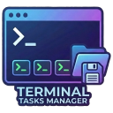

# Terminal Tasks Manager

<p align="center">
  
</p>

<p align="center">
  <a href="https://marketplace.visualstudio.com/items?itemName=cybersader.terminal-tasks-manager">
    
  </a>
  <a href="https://marketplace.visualstudio.com/items?itemName=cybersader.terminal-tasks-manager">
    
  </a>
  <a href="https://github.com/cybersader/vscode-terminal-tasks-manager/blob/main/LICENSE">
    
  </a>
</p>

A VS Code extension for managing terminal sessions with a visual sidebar interface. Supports WSL, tmux, PowerShell, nested folder organization, profiles, and more.

## Features

- **Visual Sidebar** - Manage all terminal tasks from a dedicated tree view
- **Right-Click Integration** - Add folders from Explorer, files, or terminals
- **Nested Organization** - Group tasks into folders for better organization
- **Terminal Profiles** - WSL, tmux, PowerShell, CMD, bash with customizable settings
- **tmux Integration** - Attach-or-create sessions, discover untracked sessions
- **Quick Search** - Find and run tasks instantly with fuzzy search
- **Path Validation** - Experimental feature to detect and fix broken paths

## Quick Start

1. Install the extension
2. Click the Terminal Tasks Manager icon in the Activity Bar
3. Click the `+` button or right-click a folder in Explorer → "Add Folder"
4. Choose a profile and configure your task
5. Click the play button to launch your terminal

## Keyboard Shortcuts

| Shortcut | Action |
|----------|--------|
| `Ctrl+Shift+Alt+T` | Run all terminal tasks |
| `Ctrl+Shift+Alt+A` | Add new task |
| `Ctrl+Shift+Alt+O` | Quick open task manager |

## Documentation

- **[User Guide](docs/user-guide.md)** - Complete usage instructions
- **[Configuration](docs/configuration.md)** - Settings, profiles, and customization
- **[tmux Integration](docs/tmux-integration.md)** - Working with tmux sessions
- **[Workflows](docs/workflows.md)** - Recommended workflow patterns

## For Developers

- **[Architecture](dev-docs/architecture.md)** - Codebase overview
- **[Contributing](dev-docs/contributing.md)** - How to contribute
- **[Building](dev-docs/building.md)** - Build and test instructions

## Configuration Highlights

```jsonc
{
  // Default terminal profile
  "terminalTasksManager.defaultProfile": "wsl-tmux",

  // Auto-generate tasks.json from terminal-tasks.json
  "terminalTasksManager.autoGenerateTasksJson": true,

  // Validate paths before running (experimental)
  "terminalTasksManager.experimentalPathValidation": true
}
```

See [Configuration](docs/configuration.md) for all options.

## Why Terminal Tasks Manager?

**Problem**: Managing multiple projects means constantly `cd`-ing to different directories and setting up terminal sessions.

**Solution**: Define your terminal configurations once, organize them visually, and launch them with a single click. Perfect for:

- Multi-project monorepos
- Microservices development
- Switching between work and personal projects
- Persistent tmux sessions across SSH connections

## Agentic Coding Workflows

Terminal Tasks Manager shines when working with **Claude Code**, **Cursor**, **Aider**, and other AI coding agents:

- **Multi-Agent Sessions** - Run multiple Claude Code instances in different project directories simultaneously
- **Quick Context Switching** - Jump between agent conversations across different codebases with one click
- **tmux Persistence** - Keep agent sessions alive even when VS Code restarts or SSH disconnects
- **Organized Workspaces** - Group related projects together (frontend + backend + docs) for full-stack agent workflows
- **Session Recovery** - Reconnect to running tmux sessions where your agents are still working

**Example workflow:**
1. Create tasks for each project in your stack
2. Launch Claude Code in each terminal with tmux profiles
3. Switch between agent conversations as needed
4. Close VS Code, come back later, reattach to all sessions still running

### Mobile + Desktop Seamless Coding

The ultimate setup for coding anywhere with full session persistence:

```
┌─────────────┐     Tailscale      ┌─────────────────┐
│   Phone     │◄──────SSH─────────►│  Windows PC     │
│   Termux    │                    │  WSL + tmux     │
│   + tmux    │                    │  + Claude Code  │
└─────────────┘                    └─────────────────┘
       │                                    │
       └────────► Same tmux sessions ◄──────┘
```

**The Stack:**
- **Tailscale** - Secure mesh VPN connecting all your devices
- **WSL** - Linux environment on Windows running your dev setup
- **tmux** - Session persistence that survives disconnects
- **Termux** - Full Linux terminal on Android
- **Terminal Tasks Manager** - Visual organization of all your project sessions

**How it works:**
1. Set up Tailscale on your PC and phone
2. Enable Tailscale SSH to your WSL instance
3. Create tmux-profile tasks for each project in Terminal Tasks Manager
4. Start Claude Code sessions in each tmux terminal
5. Walk away from your PC...
6. SSH from Termux on your phone → `tmux attach` → you're right where you left off
7. Come back to VS Code → click to reattach all sessions

Your AI agents keep working. Your sessions never die. Code from anywhere.

## License

MIT

## Links

- [GitHub Repository](https://github.com/cybersader/vscode-terminal-tasks-manager)
- [Report Issues](https://github.com/cybersader/vscode-terminal-tasks-manager/issues)
- [VS Code Marketplace](https://marketplace.visualstudio.com/items?itemName=cybersader.terminal-tasks-manager)
